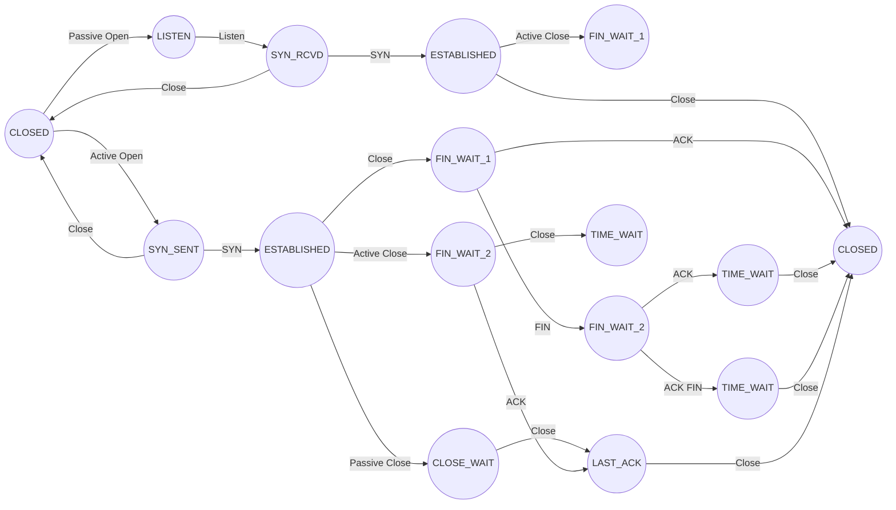
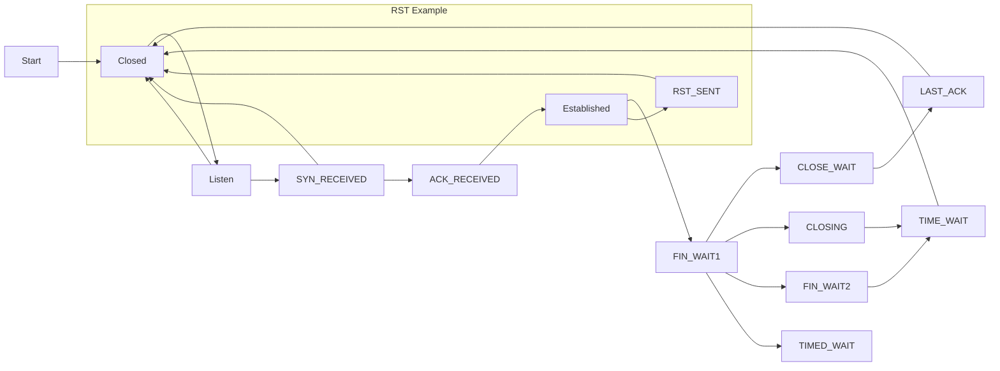
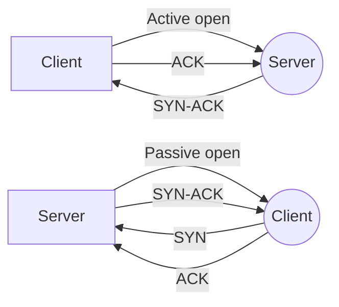
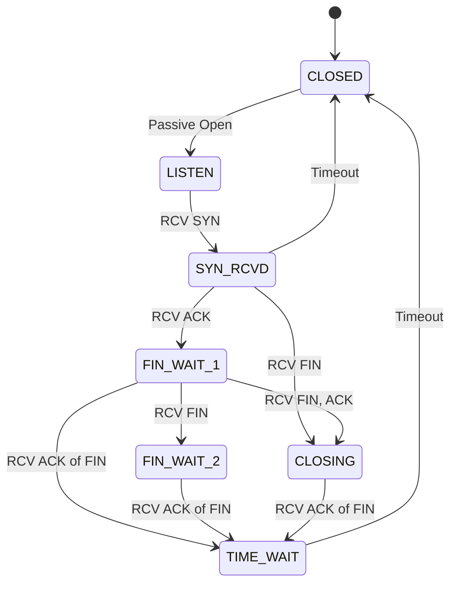

# TCP-State-machine
The TCP state machine is a conceptual model used to describe the sequence of states and transitions that occur during a TCP connection between two network hosts. It is commonly represented as a diagram with the states and transitions illustrated as nodes and arrows respectively.

TCP is a reliable, connection-oriented protocol that provides end-to-end communication between applications running on different hosts. The state machine of TCP reflects the various stages of communication that occur between the two hosts during a TCP session.

There are 11 states in the TCP state machine. These states are:

1. `CLOSED`: This is the initial state of a TCP connection. In this state, the socket is closed, and no data can be sent or received.

2. `LISTEN`: In this state, the server socket is waiting for a client connection request.

3. `SYN-SENT`: In this state, the client socket has sent a SYN (synchronize) packet to initiate a connection request to the server.

4. `SYN-RECEIVED`: In this state, the server socket has received a SYN packet and sends back a SYN-ACK (synchronize-acknowledgment) packet to confirm the connection request.

5. `ESTABLISHED`: In this state, the connection is established, and both sockets can send and receive data.

6. `FIN-WAIT-1`: In this state, the socket has received a FIN (finish) packet from the other end of the connection, indicating that the other end has finished sending data.

7. `FIN-WAIT-2`: In this state, the socket is waiting for a FIN packet from the other end.

8. `CLOSE-WAIT`: In this state, the socket has received a FIN packet from the other end and is waiting for the application to close the socket. NOTE: The connection will stay in CLOSE-WAIT until the application/process associated with the open socket forcibly closes the connection.

9. `CLOSING`: In this state, both sockets have sent FIN packets to each other, and the socket is waiting for a FIN-ACK packet from the other end.

10. `LAST-ACK`: In this state, the socket has received a FIN-ACK packet from the other end, indicating that the other end has acknowledged the connection termination request.

11. `TIME-WAIT`: In this state, the socket waits for a specified amount of time before finally closing the connection to ensure that all the packets have been delivered and there is no chance of packet loss.

See States.md in this repo for details about each state. 
## State Transitions
Each state transition in the TCP state machine is triggered by a specific event or condition. These events include:

- `Connection request`: A SYN packet is sent to the server to initiate a connection.

- `Connection response`: A SYN-ACK packet is sent back by the server to confirm the connection request.

- `Data transfer`: Data is transmitted between the two hosts.

- `Connection termination`: A FIN packet is sent by one host to indicate that it has finished sending data, and the other end responds with a FIN-ACK packet to acknowledge the termination request.

- `Timeout`: If a response is not received within a specified time, the socket may transition to a different state.
## State Diagram
The state transitions in the TCP state machine can be illustrated using a state transition diagram. This diagram shows the various states and the conditions that trigger the transitions between them.


# Connection Resets

A connection reset, also known as an RST (reset) packet, is a TCP packet that can be sent by either host to abruptly terminate a TCP connection. In the TCP state machine, a connection reset can occur in two different states: ESTABLISHED and CLOSE-WAIT. In the below flowchart, we demonstrate an example of a RST in the TCP state machine. The transition from "Established" to "RST_SENT" represents a scenario where a RST packet is sent by one of the endpoints to abruptly terminate the connection. The connection then transitions to the "Closed" state, indicating that the connection has been fully terminated.


If a host receives a TCP packet that does not fit into any of the expected sequences for an established TCP connection, it can send an RST packet to the other host to indicate that the connection should be immediately terminated. This can happen, for example, if the packet contains an incorrect sequence number or checksum, indicating that it has been corrupted or tampered with.
```
From net/ipv4/tcp_input.c

4113 /* When we get a reset we do this. */
4114 void tcp_reset(struct sock *sk)
4115 {
4116         trace_tcp_receive_reset(sk);
4117 
4118         /* We want the right error as BSD sees it (and indeed as we do). */
4119         switch (sk->sk_state) {
4120         case TCP_SYN_SENT:
4121                 sk->sk_err = ECONNREFUSED;
4122                 break;
4123         case TCP_CLOSE_WAIT:
4124                 sk->sk_err = EPIPE;
4125                 break;
4126         case TCP_CLOSE:
4127                 return;
4128         default:
4129                 sk->sk_err = ECONNRESET;
4130         }
4131         /* This barrier is coupled with smp_rmb() in tcp_poll() */
4132         smp_wmb();
4133 
4134         tcp_write_queue_purge(sk);
4135         tcp_done(sk);
4136 
4137         if (!sock_flag(sk, SOCK_DEAD))
4138                 sk->sk_error_report(sk);
4139 }

From net/ipv4/tcp.c

3840 void tcp_done(struct sock *sk)
3841 {
3842         struct request_sock *req;
3843 
3844         /* We might be called with a new socket, after
3845          * inet_csk_prepare_forced_close() has been called
3846          * so we can not use lockdep_sock_is_held(sk)
3847          */
3848         req = rcu_dereference_protected(tcp_sk(sk)->fastopen_rsk, 1);
3849 
3850         if (sk->sk_state == TCP_SYN_SENT || sk->sk_state == TCP_SYN_RECV)
3851                 TCP_INC_STATS(sock_net(sk), TCP_MIB_ATTEMPTFAILS);
3852 
3853         tcp_set_state(sk, TCP_CLOSE);
3854         tcp_clear_xmit_timers(sk);
3855         if (req)
3856                 reqsk_fastopen_remove(sk, req, false);
3857 
3858         sk->sk_shutdown = SHUTDOWN_MASK;
3859 
3860         if (!sock_flag(sk, SOCK_DEAD))
3861                 sk->sk_state_change(sk);
3862         else
3863                 inet_csk_destroy_sock(sk);
3864 }
```

In the ESTABLISHED state, a connection reset can be initiated by either host. The host that initiates the reset sends an RST packet, and the other host responds by transitioning to the CLOSED state.

In the CLOSE-WAIT state, if the application has not closed the socket, and the other end sends an RST packet, the socket transitions to the CLOSED state immediately without waiting for the application to close the socket.

```
From net/ipv4/tcp_input.c

4141 /*
4142  *      Process the FIN bit. This now behaves as it is supposed to work
4143  *      and the FIN takes effect when it is validly part of sequence
4144  *      space. Not before when we get holes.
4145  *
4146  *      If we are ESTABLISHED, a received fin moves us to CLOSE-WAIT
4147  *      (and thence onto LAST-ACK and finally, CLOSE, we never enter
4148  *      TIME-WAIT)
4149  *
4150  *      If we are in FINWAIT-1, a received FIN indicates simultaneous
4151  *      close and we go into CLOSING (and later onto TIME-WAIT)
4152  *
4153  *      If we are in FINWAIT-2, a received FIN moves us to TIME-WAIT.
4154  */
4155 void tcp_fin(struct sock *sk)
```

The state transition diagram for TCP does not explicitly show the RST packet as a separate state, but rather as a mechanism for transitioning to the CLOSED state from other states.

# Active/Passive Open


`Active open` refers to the process of initiating a TCP connection by the client, where the client sends a SYN packet to the server to request the establishment of a connection. The server responds with a SYN-ACK packet to confirm the connection request, and the client sends an ACK packet to acknowledge the response. This process is also called a client-initiated connection or outbound connection.

`Passive open`, on the other hand, refers to the process of initiating a TCP connection by the server, where the server waits for a connection request from the client. In this method, the server socket is opened and set to listen for incoming connection requests. When a client sends a SYN packet to the server, the server responds with a SYN-ACK packet to confirm the connection request, and the client sends an ACK packet to acknowledge the response. This process is also called a server-initiated connection or inbound connection.

# Passive Close


`Passive close` refers to the process of closing a TCP connection initiated by the receiving endpoint. When the receiving endpoint has no more data to send, it sends a FIN message to the other endpoint and transitions to the passive close state. In the passive close state, the endpoint is waiting for an acknowledgement (ACK) from the other endpoint to confirm that it has received the FIN message. 

Once the other endpoint sends an ACK message, the connection transitions to the TIME-WAIT state. In the TIME-WAIT state, the endpoint waits for any delayed packets that may still be in transit before fully closing the connection. After the TIME-WAIT period has expired, the endpoint transitions to the CLOSED state, and the connection is fully closed.

# Active Close


An `active close` is a way to close a TCP connection in which one endpoint (usually the one that initiated the connection) sends a FIN (finish) message to the other endpoint, indicating that it has no more data to send and wishes to close the connection. This is known as an active close because the initiating endpoint takes an active role in closing the connection.

In an active close, the initiating endpoint sends a FIN message, transitions to the FIN_WAIT_1 state, and waits for an ACK message from the other endpoint. Once the initiating endpoint receives the ACK message, it transitions to the FIN_WAIT_2 state and waits for a FIN message from the other endpoint. When the other endpoint sends a FIN message, the initiating endpoint sends an ACK message, transitions to the TIME_WAIT state, and waits for a period of time before transitioning to the CLOSED state.

Active close is often used when the application that initiated the connection has finished sending data and wishes to cleanly close the connection. In contrast, a passive close is when an endpoint receives a FIN message from the other endpoint, indicating that the other endpoint wishes to close the connection.

Sources:
https://www.ietf.org/rfc/rfc793.txt
