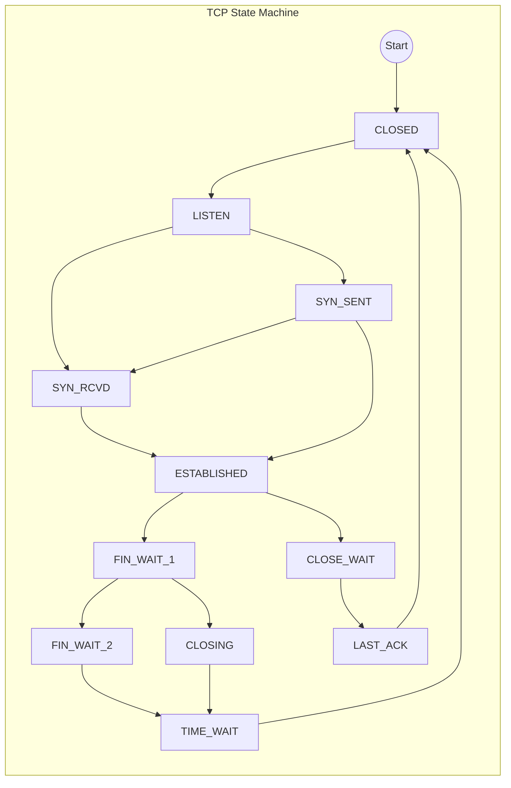
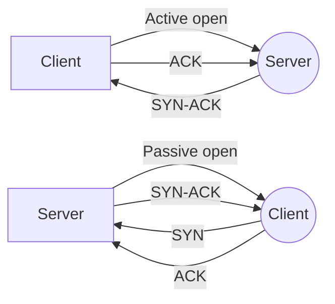

# TCP-State-machine

The TCP state machine is a conceptual model used to describe the sequence of states and transitions that occur during a TCP connection between two network hosts. It is commonly represented as a diagram with the states and transitions illustrated as nodes and arrows respectively.

TCP is a reliable, connection-oriented protocol that provides end-to-end communication between applications running on different hosts. The state machine of TCP reflects the various stages of communication that occur between the two hosts during a TCP session.

There are 11 states in the TCP state machine. These states are:

1. CLOSED: This is the initial state of a TCP connection. In this state, the socket is closed, and no data can be sent or received.

2. LISTEN: In this state, the server socket is waiting for a client connection request.

3. SYN-SENT: In this state, the client socket has sent a SYN (synchronize) packet to initiate a connection request to the server.

4. SYN-RECEIVED: In this state, the server socket has received a SYN packet and sends back a SYN-ACK (synchronize-acknowledgment) packet to confirm the connection request.

5. ESTABLISHED: In this state, the connection is established, and both sockets can send and receive data.

6. FIN-WAIT-1: In this state, the socket has received a FIN (finish) packet from the other end of the connection, indicating that the other end has finished sending data.

7. FIN-WAIT-2: In this state, the socket is waiting for a FIN packet from the other end.

8. CLOSE-WAIT: In this state, the socket has received a FIN packet from the other end and is waiting for the application to close the socket.

9. CLOSING: In this state, both sockets have sent FIN packets to each other, and the socket is waiting for a FIN-ACK packet from the other end.

10. LAST-ACK: In this state, the socket has received a FIN-ACK packet from the other end, indicating that the other end has acknowledged the connection termination request.

11. TIME-WAIT: In this state, the socket waits for a specified amount of time before finally closing the connection to ensure that all the packets have been delivered and there is no chance of packet loss.

Each state transition in the TCP state machine is triggered by a specific event or condition. These events include:

Connection request: A SYN packet is sent to the server to initiate a connection.

Connection response: A SYN-ACK packet is sent back by the server to confirm the connection request.

Data transfer: Data is transmitted between the two hosts.

Connection termination: A FIN packet is sent by one host to indicate that it has finished sending data, and the other end responds with a FIN-ACK packet to acknowledge the termination request.

Timeout: If a response is not received within a specified time, the socket may transition to a different state.

The state transitions in the TCP state machine can be illustrated using a state transition diagram. This diagram shows the various states and the conditions that trigger the transitions between them.

A connection reset, also known as an RST (reset) packet, is a TCP packet that can be sent by either host to abruptly terminate a TCP connection. In the TCP state machine, a connection reset can occur in two different states: ESTABLISHED and CLOSE-WAIT.

If a host receives a TCP packet that does not fit into any of the expected sequences for an established TCP connection, it can send an RST packet to the other host to indicate that the connection should be immediately terminated. This can happen, for example, if the packet contains an incorrect sequence number or checksum, indicating that it has been corrupted or tampered with.

In the ESTABLISHED state, a connection reset can be initiated by either host. The host that initiates the reset sends an RST packet, and the other host responds by transitioning to the CLOSED state.

In the CLOSE-WAIT state, if the application has not closed the socket, and the other end sends an RST packet, the socket transitions to the CLOSED state immediately without waiting for the application to close the socket.

The state transition diagram for TCP does not explicitly show the RST packet as a separate state, but rather as a mechanism for transitioning to the CLOSED state from other states.

Active open refers to the process of initiating a TCP connection by the client, where the client sends a SYN packet to the server to request the establishment of a connection. The server responds with a SYN-ACK packet to confirm the connection request, and the client sends an ACK packet to acknowledge the response. This process is also called a client-initiated connection or outbound connection.

Passive open, on the other hand, refers to the process of initiating a TCP connection by the server, where the server waits for a connection request from the client. In this method, the server socket is opened and set to listen for incoming connection requests. When a client sends a SYN packet to the server, the server responds with a SYN-ACK packet to confirm the connection request, and the client sends an ACK packet to acknowledge the response. This process is also called a server-initiated connection or inbound connection.

Sources:
https://www.ietf.org/rfc/rfc793.txt
