# TCP-State-machine
The TCP state machine is a conceptual model used to describe the sequence of states and transitions that occur during a TCP connection between two network hosts. It is commonly represented as a diagram with the states and transitions illustrated as nodes and arrows respectively.

TCP is a reliable, connection-oriented protocol that provides end-to-end communication between applications running on different hosts. The state machine of TCP reflects the various stages of communication that occur between the two hosts during a TCP session.

There are 11 states in the TCP state machine. These states are:

## 1. CLOSED: 
This is the initial state of a TCP connection. In this state, the socket is closed, and no data can be sent or received.
## 2. LISTEN: 
The LISTEN state is the initial state of a passive open connection. In this state, the server socket waits for an incoming connection request from a client.

When a client initiates a connection request, it sends a SYN (Synchronize) segment to the server. The server socket then transitions to the SYN-RECEIVED state, sends a SYN-ACK (Synchronize-Acknowledgement) segment to the client, and waits for an ACK (Acknowledgment) segment from the client to complete the connection establishment process.

During the LISTEN state, the server socket is not actively transmitting or receiving data. It is only monitoring the network for incoming connection requests. Once the server receives a connection request, it can transition to a different state to handle the request and exchange data with the client.
## 3. SYN-SENT: 
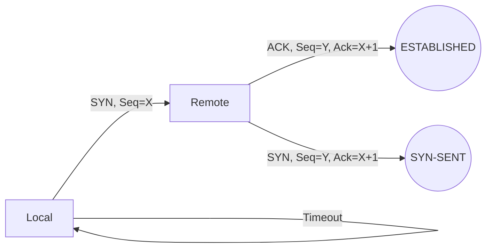
The SYN-SENT state is the state of an active open connection when the client sends a SYN (Synchronize) segment to the server to initiate a connection request.

When a client wants to establish a connection with a server, it sends a SYN segment to the server, which includes an initial sequence number (ISN). The client then enters the SYN-SENT state, waiting for a SYN-ACK (Synchronize-Acknowledgement) segment from the server.

If the server accepts the connection request, it will send a SYN-ACK segment back to the client, including its own ISN. At this point, the client enters the ESTABLISHED state, sends an ACK segment back to the server to acknowledge the SYN-ACK, and begins transmitting data.

If the server does not respond with a SYN-ACK segment, or if the client receives a RST (Reset) segment from the server indicating that the connection request was rejected or the server is unavailable, the client will close the connection by sending a FIN (Finish) segment and transitioning to the CLOSED state.

During the SYN-SENT state, the client is actively transmitting data (the SYN segment) and waiting for a response from the server.
## 4. SYN-RECEIVED: 
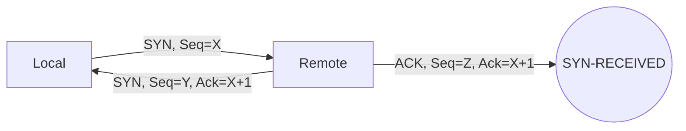
The SYN-RECEIVED state is the state of a passive open connection when the server receives a SYN (Synchronize) segment from a client to initiate a connection request.

When a client sends a SYN segment to the server, the server socket enters the SYN-RECEIVED state and sends a SYN-ACK (Synchronize-Acknowledgement) segment back to the client, which includes the server's own initial sequence number (ISN). The server then waits for an ACK (Acknowledgment) segment from the client to complete the connection establishment process.

If the client acknowledges the SYN-ACK segment by sending an ACK segment to the server, the server transitions to the ESTABLISHED state and can begin transmitting and receiving data. If the client does not send an ACK segment, or if the server does not receive the ACK segment, it will eventually time out and close the connection.

During the SYN-RECEIVED state, the server is actively transmitting data (the SYN-ACK segment) and waiting for a response from the client to complete the connection establishment process.

## 5. ESTABLISHED:
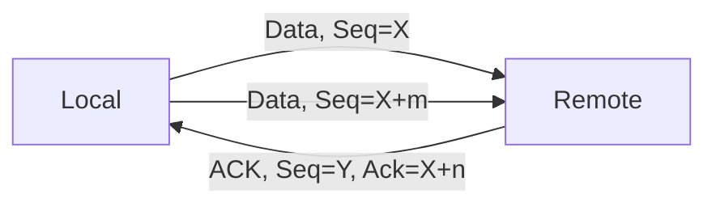
The ESTABLISHED state is the state when a connection has been established between two endpoints, and both the client and the server are ready to transmit and receive data.

Once the three-way handshake is completed (SYN, SYN-ACK, ACK), both the client and server enter the ESTABLISHED state. In this state, both endpoints can transmit and receive data packets to and from each other.

In the ESTABLISHED state, the sequence numbers are used to keep track of the transmitted and received data. The data is transmitted in segments, and each segment is assigned a sequence number to keep track of it. The receiver acknowledges the receipt of each segment by sending an acknowledgement (ACK) packet with the next expected sequence number.

If there is no activity for a specified period of time, either endpoint can send a keep-alive message to ensure that the connection remains open. When either endpoint is done with the connection, it sends a FIN (Finish) packet to initiate the connection termination process and transition to the FIN-WAIT-1 state.

During the ESTABLISHED state, both endpoints are actively transmitting and receiving data as required by the application protocols running on top of TCP.
## 6. FIN-WAIT-1:
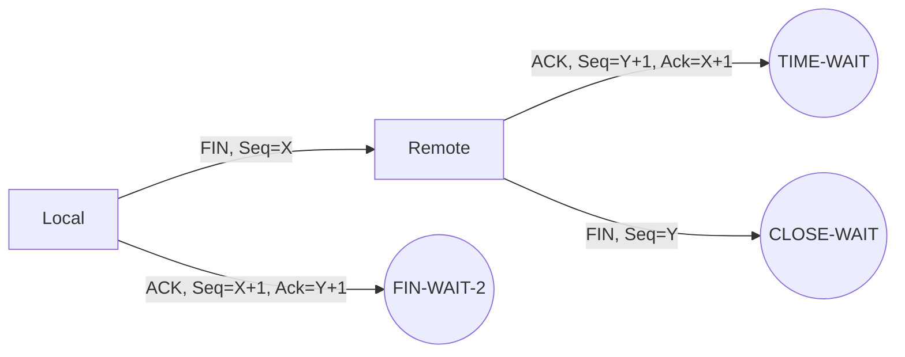
The FIN-WAIT-1 state is the state when an endpoint has sent a FIN (Finish) segment to initiate the connection termination process, but has not yet received an ACK (Acknowledgment) segment from the other endpoint to confirm the receipt of the FIN segment.

When an endpoint wants to terminate a connection, it sends a FIN segment to the other endpoint. The endpoint then transitions to the FIN-WAIT-1 state and waits for an ACK segment from the other endpoint to confirm the receipt of the FIN segment.

If the other endpoint acknowledges the FIN segment with an ACK segment, it transitions to the CLOSE-WAIT state, indicating that it has received a FIN segment and will no longer send any data. If the other endpoint sends any more data, it will be ignored.

If the other endpoint does not send an ACK segment in response to the FIN segment, the endpoint will eventually time out and transition to the FIN-WAIT-2 state.

During the FIN-WAIT-1 state, the endpoint is waiting for the other endpoint to acknowledge the receipt of the FIN segment and confirm the termination of the connection. If the endpoint receives any data from the other endpoint, it will acknowledge the data with an ACK segment and transition to the ESTABLISHED state.
## 7. FIN-WAIT-2:
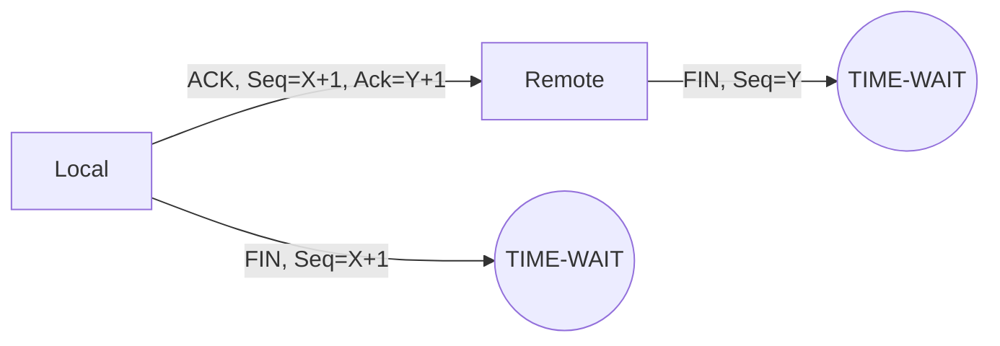
The FIN-WAIT-2 state is the state when an endpoint has received a FIN (Finish) segment from the other endpoint and sent an ACK (Acknowledgment) segment in response, but has not yet received a FIN segment from the other endpoint.

When an endpoint receives a FIN segment from the other endpoint, it sends an ACK segment in response and transitions to the FIN-WAIT-2 state. The endpoint waits for the other endpoint to send a FIN segment to confirm the termination of the connection.

If the other endpoint sends a FIN segment, the endpoint transitions to the TIME-WAIT state, which is a brief period during which the endpoint waits to ensure that all packets in the connection have been delivered and acknowledged. After the TIME-WAIT state, the endpoint transitions to the CLOSED state.

If the other endpoint does not send a FIN segment, the endpoint will eventually time out and transition to the CLOSED state.

During the FIN-WAIT-2 state, the endpoint has acknowledged the receipt of the FIN segment and sent an ACK segment in response. It is waiting for the other endpoint to confirm the termination of the connection by sending a FIN segment.
## 8. CLOSE-WAIT:
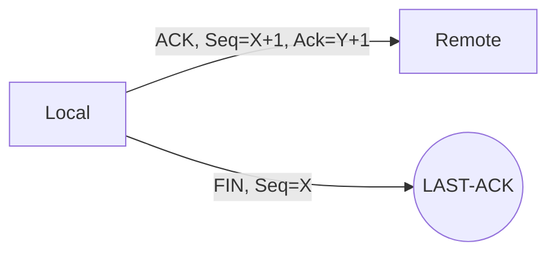
The CLOSE-WAIT state is the state when an endpoint has received a FIN (Finish) segment from the other endpoint and has acknowledged it with an ACK (Acknowledgment) segment, but still has some data to send before terminating the connection.

When an endpoint receives a FIN segment from the other endpoint, it acknowledges the receipt of the FIN segment with an ACK segment and transitions to the CLOSE-WAIT state. In the CLOSE-WAIT state, the endpoint may continue to send data to the other endpoint.

Once the endpoint has finished sending data, it sends a FIN segment to the other endpoint to initiate the connection termination process. The endpoint then transitions to the LAST-ACK state and waits for an ACK segment from the other endpoint to confirm the receipt of the FIN segment.

If the other endpoint acknowledges the FIN segment with an ACK segment, the endpoint transitions to the CLOSED state. If the other endpoint does not acknowledge the FIN segment, the endpoint will eventually time out and transition to the CLOSED state.

During the CLOSE-WAIT state, the endpoint has received a FIN segment from the other endpoint and acknowledged it with an ACK segment, but still has some data to send before terminating the connection. Once the endpoint has finished sending data, it initiates the connection termination process by sending a FIN segment to the other endpoint.

## 9. CLOSING:
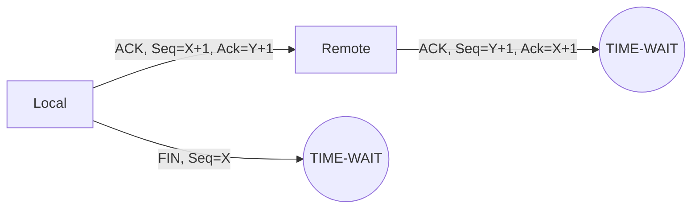
The CLOSING state is the state when an endpoint has sent a FIN (Finish) segment to initiate the connection termination process and has received an ACK (Acknowledgment) segment from the other endpoint, but has not yet received a FIN segment from the other endpoint to confirm the termination of the connection.

When an endpoint sends a FIN segment to initiate the connection termination process, it transitions to the FIN-WAIT-1 state. If the other endpoint acknowledges the FIN segment with an ACK segment, it transitions to the FIN-WAIT-2 state. However, if the other endpoint also sends a FIN segment in response to the FIN segment, it transitions to the CLOSING state.

In the CLOSING state, the endpoint has sent a FIN segment and received an ACK segment from the other endpoint, indicating that the other endpoint has received the FIN segment. However, the endpoint is still waiting for the other endpoint to send a FIN segment to confirm the termination of the connection.

If the other endpoint sends a FIN segment in response to the FIN segment, the endpoint transitions to the TIME-WAIT state, which is a brief period during which the endpoint waits to ensure that all packets in the connection have been delivered and acknowledged. After the TIME-WAIT state, the endpoint transitions to the CLOSED state.

If the other endpoint does not send a FIN segment, the endpoint will eventually time out and transition to the CLOSED state.

During the CLOSING state, the endpoint has sent a FIN segment and received an ACK segment from the other endpoint, indicating that the other endpoint has received the FIN segment. However, the endpoint is still waiting for the other endpoint to confirm the termination of the connection by sending a FIN segment.
## 10. LAST-ACK:
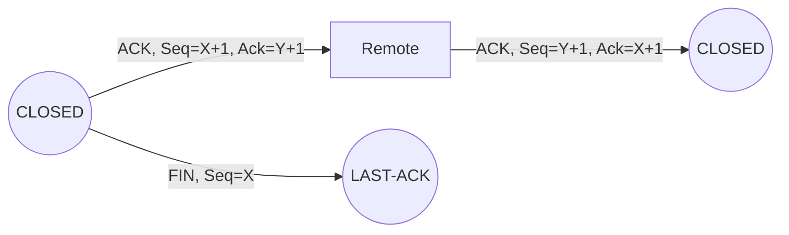
The LAST-ACK state is the state when an endpoint has sent a FIN (Finish) segment to initiate the connection termination process and has received an ACK (Acknowledgment) segment and a FIN segment from the other endpoint.

When an endpoint sends a FIN segment to initiate the connection termination process, it transitions to the FIN-WAIT-1 state. If the other endpoint acknowledges the FIN segment with an ACK segment, it transitions to the FIN-WAIT-2 state. If the other endpoint also sends a FIN segment in response to the FIN segment, it transitions to the CLOSING state, and once it receives an ACK segment from the other endpoint, it transitions to the LAST-ACK state.

In the LAST-ACK state, the endpoint has sent a FIN segment to initiate the connection termination process and has received an ACK segment and a FIN segment from the other endpoint. The endpoint acknowledges the FIN segment from the other endpoint with an ACK segment and waits for the other endpoint to acknowledge the FIN segment it sent.

Once the other endpoint acknowledges the FIN segment with an ACK segment, the endpoint transitions to the CLOSED state, indicating that the connection has been terminated.

If the other endpoint does not acknowledge the FIN segment with an ACK segment, the endpoint will eventually time out and transition to the CLOSED state.

During the LAST-ACK state, the endpoint has sent a FIN segment to initiate the connection termination process and has received an ACK segment and a FIN segment from the other endpoint. It acknowledges the FIN segment from the other endpoint with an ACK segment and waits for the other endpoint to acknowledge the FIN segment it sent before transitioning to the CLOSED state.
## 11. TIME-WAIT:
The TIME-WAIT state is a brief period during which an endpoint waits to ensure that all packets in the connection have been delivered and acknowledged before terminating the connection.

When an endpoint sends a FIN (Finish) segment to initiate the connection termination process, it transitions to the FIN-WAIT-1 state. If the other endpoint acknowledges the FIN segment with an ACK segment, it transitions to the FIN-WAIT-2 state. If the other endpoint also sends a FIN segment in response to the FIN segment, it transitions to the CLOSING state, and once it receives an ACK segment from the other endpoint, it transitions to the LAST-ACK state. Once the other endpoint acknowledges the FIN segment with an ACK segment, it transitions to the TIME-WAIT state.

In the TIME-WAIT state, the endpoint waits for a period of time to ensure that all packets related to the connection have been delivered and acknowledged. This is to prevent any stray packets related to the connection from being mistaken for new connections.

During the TIME-WAIT state, the endpoint cannot initiate any new connections or receive any new packets related to the previous connection. However, it can continue to receive and process any packets that were sent before the connection was terminated.

Once the TIME-WAIT state period expires, the endpoint transitions to the CLOSED state and the connection is fully terminated.

The duration of the TIME-WAIT state varies depending on the implementation and configuration of the TCP protocol, but it is typically set to twice the maximum segment lifetime (2MSL), which is the maximum amount of time that a TCP segment can remain in the network before being discarded.
## State Transitions
Each state transition in the TCP state machine is triggered by a specific event or condition. These events include:

- Connection request: A SYN packet is sent to the server to initiate a connection.

- Connection response: A SYN-ACK packet is sent back by the server to confirm the connection request.

- Data transfer: Data is transmitted between the two hosts.

- Connection termination: A FIN packet is sent by one host to indicate that it has finished sending data, and the other end responds with a FIN-ACK packet to acknowledge the termination request.

- Timeout: If a response is not received within a specified time, the socket may transition to a different state.
## State Diagram
The state transitions in the TCP state machine can be illustrated using a state transition diagram. This diagram shows the various states and the conditions that trigger the transitions between them.

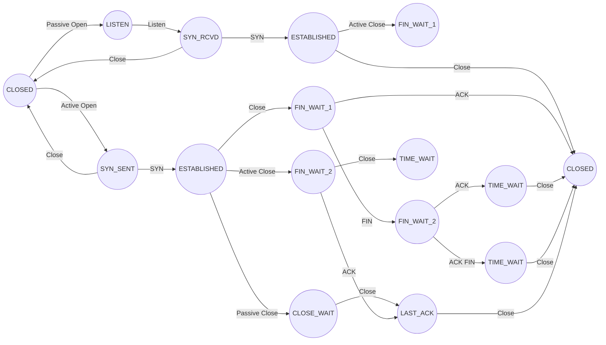
# Connection Resets

A connection reset, also known as an RST (reset) packet, is a TCP packet that can be sent by either host to abruptly terminate a TCP connection. In the TCP state machine, a connection reset can occur in two different states: ESTABLISHED and CLOSE-WAIT. In the below flowchart, we demonstrate an example of a RST in the TCP state machine. The transition from "Established" to "RST_SENT" represents a scenario where a RST packet is sent by one of the endpoints to abruptly terminate the connection. The connection then transitions to the "Closed" state, indicating that the connection has been fully terminated.

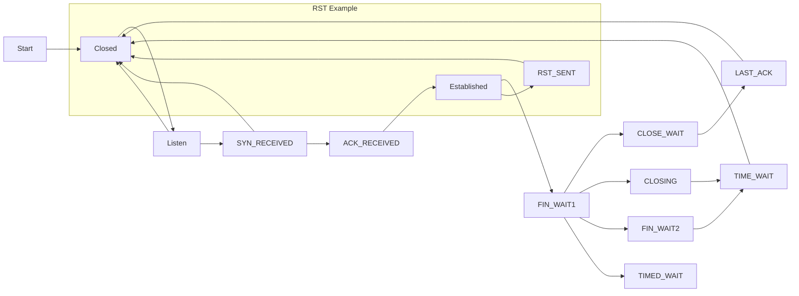
If a host receives a TCP packet that does not fit into any of the expected sequences for an established TCP connection, it can send an RST packet to the other host to indicate that the connection should be immediately terminated. This can happen, for example, if the packet contains an incorrect sequence number or checksum, indicating that it has been corrupted or tampered with.
```
From net/ipv4/tcp_input.c

4113 /* When we get a reset we do this. */
4114 void tcp_reset(struct sock *sk)
4115 {
4116         trace_tcp_receive_reset(sk);
4117 
4118         /* We want the right error as BSD sees it (and indeed as we do). */
4119         switch (sk->sk_state) {
4120         case TCP_SYN_SENT:
4121                 sk->sk_err = ECONNREFUSED;
4122                 break;
4123         case TCP_CLOSE_WAIT:
4124                 sk->sk_err = EPIPE;
4125                 break;
4126         case TCP_CLOSE:
4127                 return;
4128         default:
4129                 sk->sk_err = ECONNRESET;
4130         }
4131         /* This barrier is coupled with smp_rmb() in tcp_poll() */
4132         smp_wmb();
4133 
4134         tcp_write_queue_purge(sk);
4135         tcp_done(sk);
4136 
4137         if (!sock_flag(sk, SOCK_DEAD))
4138                 sk->sk_error_report(sk);
4139 }

From net/ipv4/tcp.c

3840 void tcp_done(struct sock *sk)
3841 {
3842         struct request_sock *req;
3843 
3844         /* We might be called with a new socket, after
3845          * inet_csk_prepare_forced_close() has been called
3846          * so we can not use lockdep_sock_is_held(sk)
3847          */
3848         req = rcu_dereference_protected(tcp_sk(sk)->fastopen_rsk, 1);
3849 
3850         if (sk->sk_state == TCP_SYN_SENT || sk->sk_state == TCP_SYN_RECV)
3851                 TCP_INC_STATS(sock_net(sk), TCP_MIB_ATTEMPTFAILS);
3852 
3853         tcp_set_state(sk, TCP_CLOSE);
3854         tcp_clear_xmit_timers(sk);
3855         if (req)
3856                 reqsk_fastopen_remove(sk, req, false);
3857 
3858         sk->sk_shutdown = SHUTDOWN_MASK;
3859 
3860         if (!sock_flag(sk, SOCK_DEAD))
3861                 sk->sk_state_change(sk);
3862         else
3863                 inet_csk_destroy_sock(sk);
3864 }
```

In the ESTABLISHED state, a connection reset can be initiated by either host. The host that initiates the reset sends an RST packet, and the other host responds by transitioning to the CLOSED state.

In the CLOSE-WAIT state, if the application has not closed the socket, and the other end sends an RST packet, the socket transitions to the CLOSED state immediately without waiting for the application to close the socket.

```
From net/ipv4/tcp_input.c

4141 /*
4142  *      Process the FIN bit. This now behaves as it is supposed to work
4143  *      and the FIN takes effect when it is validly part of sequence
4144  *      space. Not before when we get holes.
4145  *
4146  *      If we are ESTABLISHED, a received fin moves us to CLOSE-WAIT
4147  *      (and thence onto LAST-ACK and finally, CLOSE, we never enter
4148  *      TIME-WAIT)
4149  *
4150  *      If we are in FINWAIT-1, a received FIN indicates simultaneous
4151  *      close and we go into CLOSING (and later onto TIME-WAIT)
4152  *
4153  *      If we are in FINWAIT-2, a received FIN moves us to TIME-WAIT.
4154  */
4155 void tcp_fin(struct sock *sk)
```

The state transition diagram for TCP does not explicitly show the RST packet as a separate state, but rather as a mechanism for transitioning to the CLOSED state from other states.

# Active/Passive Open
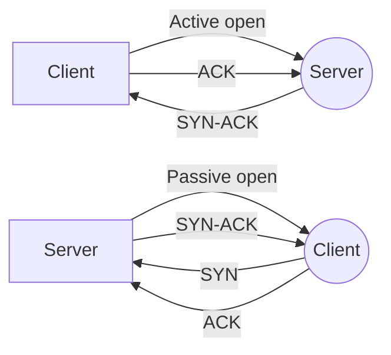

Active open refers to the process of initiating a TCP connection by the client, where the client sends a SYN packet to the server to request the establishment of a connection. The server responds with a SYN-ACK packet to confirm the connection request, and the client sends an ACK packet to acknowledge the response. This process is also called a client-initiated connection or outbound connection.

Passive open, on the other hand, refers to the process of initiating a TCP connection by the server, where the server waits for a connection request from the client. In this method, the server socket is opened and set to listen for incoming connection requests. When a client sends a SYN packet to the server, the server responds with a SYN-ACK packet to confirm the connection request, and the client sends an ACK packet to acknowledge the response. This process is also called a server-initiated connection or inbound connection.

# Passive Close
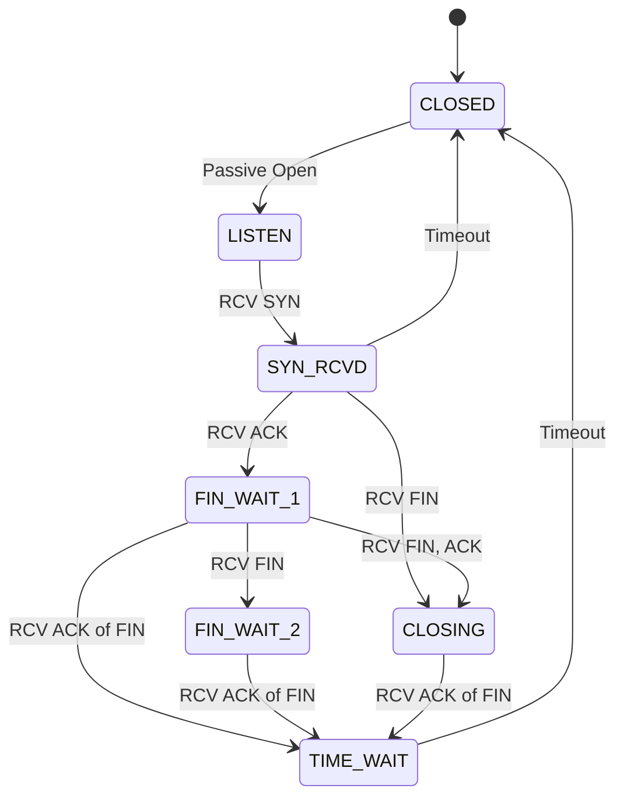

Passive close refers to the process of closing a TCP connection initiated by the receiving endpoint. When the receiving endpoint has no more data to send, it sends a FIN message to the other endpoint and transitions to the passive close state. In the passive close state, the endpoint is waiting for an acknowledgement (ACK) from the other endpoint to confirm that it has received the FIN message. 

Once the other endpoint sends an ACK message, the connection transitions to the TIME-WAIT state. In the TIME-WAIT state, the endpoint waits for any delayed packets that may still be in transit before fully closing the connection. After the TIME-WAIT period has expired, the endpoint transitions to the CLOSED state, and the connection is fully closed.

# Active Close

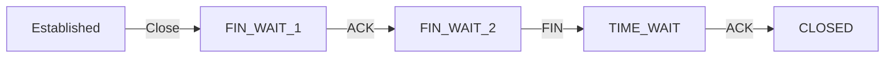
An active close is a way to close a TCP connection in which one endpoint (usually the one that initiated the connection) sends a FIN (finish) message to the other endpoint, indicating that it has no more data to send and wishes to close the connection. This is known as an active close because the initiating endpoint takes an active role in closing the connection.

In an active close, the initiating endpoint sends a FIN message, transitions to the FIN_WAIT_1 state, and waits for an ACK message from the other endpoint. Once the initiating endpoint receives the ACK message, it transitions to the FIN_WAIT_2 state and waits for a FIN message from the other endpoint. When the other endpoint sends a FIN message, the initiating endpoint sends an ACK message, transitions to the TIME_WAIT state, and waits for a period of time before transitioning to the CLOSED state.

Active close is often used when the application that initiated the connection has finished sending data and wishes to cleanly close the connection. In contrast, a passive close is when an endpoint receives a FIN message from the other endpoint, indicating that the other endpoint wishes to close the connection.

Sources:
https://www.ietf.org/rfc/rfc793.txt
